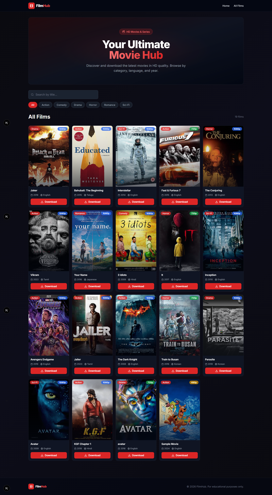
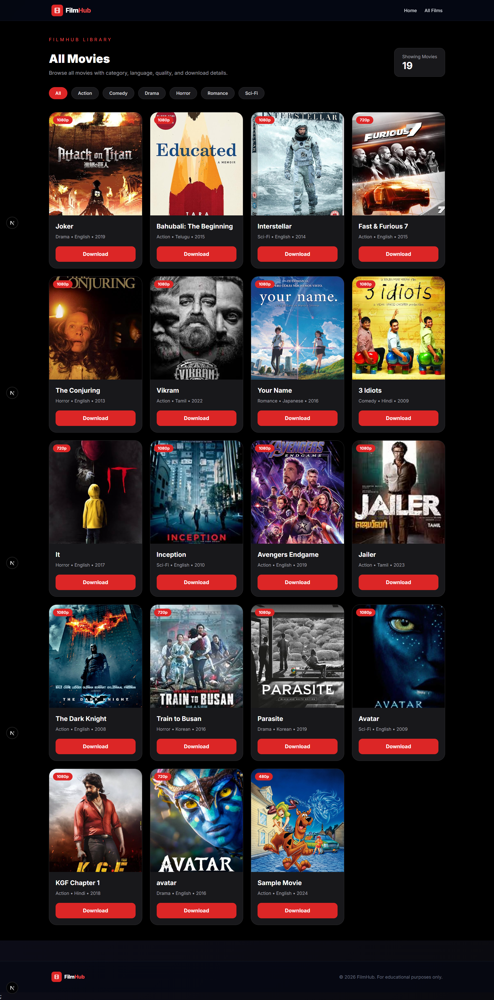
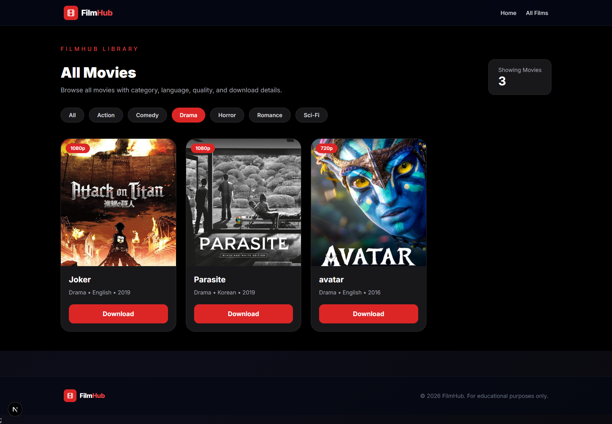
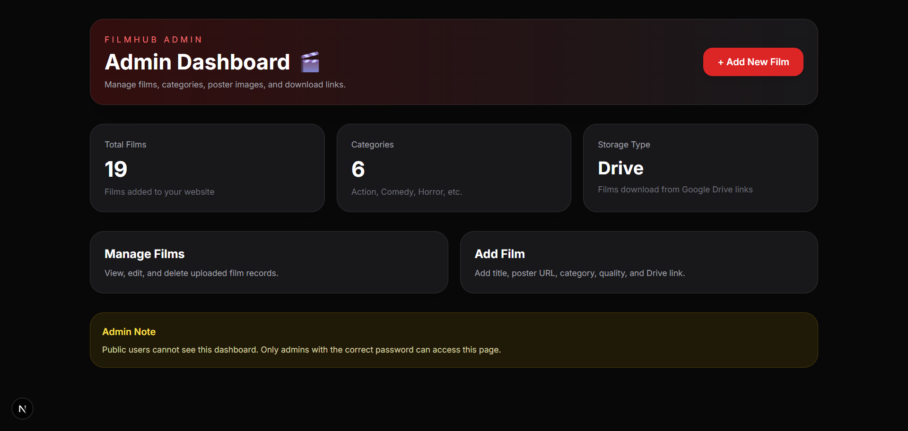
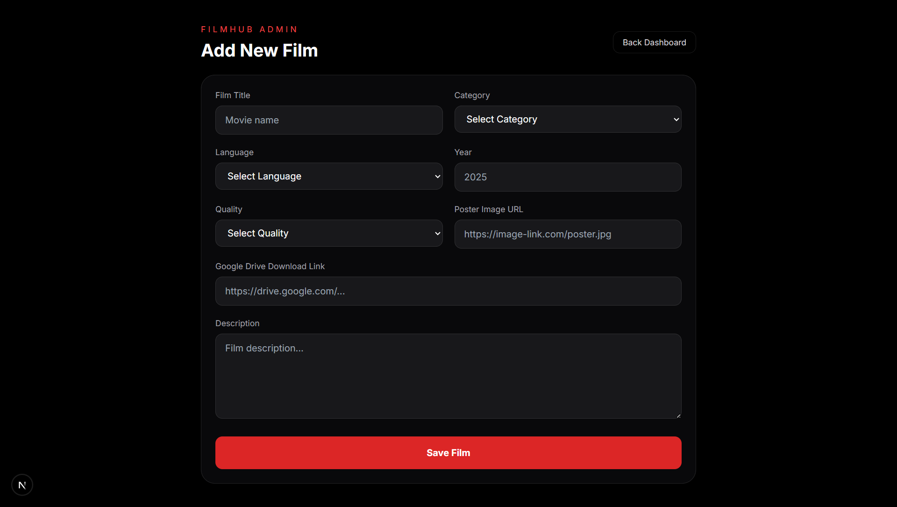
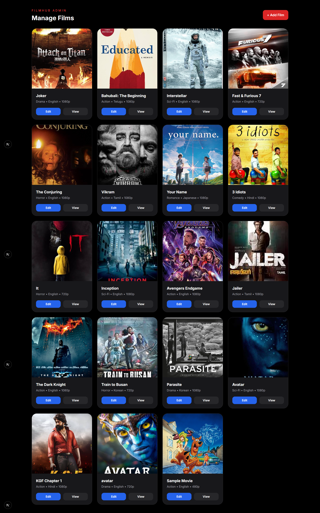

# 🎬 Film Management System

A modern web-based Film Management System built with **Next.js**, **TypeScript**, and **Supabase**. The platform allows administrators to manage film content efficiently while providing users with a clean and responsive interface to browse films by category.

---

## 📌 Project Overview

The Film Management System is designed to simplify film catalog management through an intuitive admin dashboard and a user-friendly public interface.

Users can:

- Browse available films
- Filter films by categories
- View film information
- Access a responsive and modern UI

Administrators can:

- Add new films
- Edit existing films
- Delete films
- Manage film information through a dedicated admin panel

---

## 🚀 Features

### User Features

- Browse all available films
- Category-based film filtering
- Responsive design for desktop and mobile devices
- Film poster display
- Clean and intuitive user interface

### Admin Features

- Secure Admin Dashboard
- Add New Films
- Update Film Details
- Delete Films
- Manage Film Collection
- Real-time data management using Supabase

---

## 🛠️ Technology Stack

### Frontend

- Next.js
- React
- TypeScript
- Tailwind CSS

### Backend & Database

- Supabase
- PostgreSQL

### Development Tools

- Visual Studio Code
- Git
- GitHub

---

# 📸 Screenshots

## Home Page

The landing page displays featured films and provides easy navigation through the platform.



---

## All Films Page

The All Films page displays the complete collection of available films, allowing users to explore the entire catalog in one place.



---

## Films Page with Category Filter

Users can filter films by category for easier browsing.



---

## Admin Dashboard

The admin dashboard provides quick access to all management features.



---

## Add New Film

Administrators can add new films through a simple form interface.



---

## Manage Films

Administrators can view, edit, and delete films from the management section.



---

# 📂 Project Structure

```bash
film-management-system/
│
├── public/
│   ├── screenshots/
│   └── images/
│
├── src/
│   ├── app/
│   ├── components/
│   ├── lib/
│   ├── types/
│   └── styles/
│
├── supabase/
│
├── package.json
├── tsconfig.json
├── next.config.js
└── README.md
```

---

# ⚙️ Installation

## Clone the Repository

```bash
git clone https://github.com/yourusername/film-management-system.git
```

## Navigate to Project Directory

```bash
cd film-management-system
```

## Install Dependencies

```bash
npm install
```

## Configure Environment Variables

Create a `.env.local` file in the root directory.

```env
NEXT_PUBLIC_SUPABASE_URL=your_supabase_url
NEXT_PUBLIC_SUPABASE_ANON_KEY=your_supabase_anon_key
```

---

## Run the Development Server

```bash
npm run dev
```

Open your browser and visit:

```text
http://localhost:3000
```

---

# 🗄️ Database Schema

### Films Table

| Field | Type |
|---------|---------|
| id | UUID |
| title | Text |
| description | Text |
| image_url | Text |
| category | Text |
| language | Text |
| quality | Text |
| created_at | Timestamp |

---

# 📖 Usage

### User Side

1. Visit the home page.
2. Browse available films.
3. Filter films by category.
4. View film details.

### Admin Side

1. Navigate to the admin panel.
2. Add new films.
3. Update film information.
4. Delete unwanted films.
5. Manage the entire film catalog.

---

# 🎯 Learning Outcomes

This project demonstrates:

- Full-Stack Web Development
- Modern React Development
- Next.js App Router
- TypeScript Development
- Database Integration with Supabase
- CRUD Operations
- Responsive UI Design
- State Management
- API Integration

---

# 🔮 Future Improvements

- User Authentication
- Film Search Functionality
- Watchlist Feature
- Film Rating System
- Trailer Integration
- Pagination
- Advanced Filtering
- Dark Mode Support

---

# 👨‍💻 Author

**Dinesh Rathnasiri**

Final Year Undergraduate  
B.Sc. Physical Science (ICT)  
University of Sri Jayewardenepura

GitHub: https://github.com/yourusername

---

# 📄 License

This project is developed for educational and portfolio purposes.

© 2026 Dinesh Rathnasiri. All Rights Reserved.
